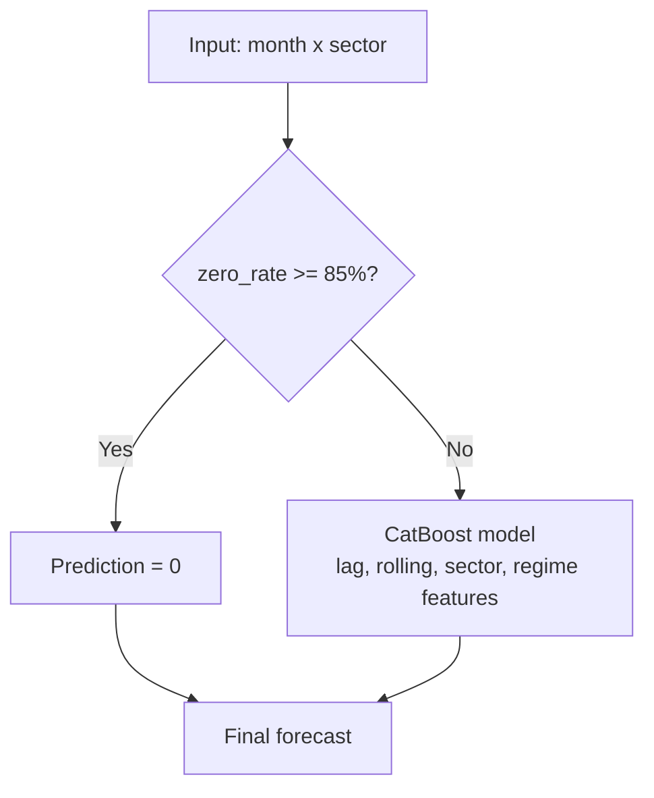
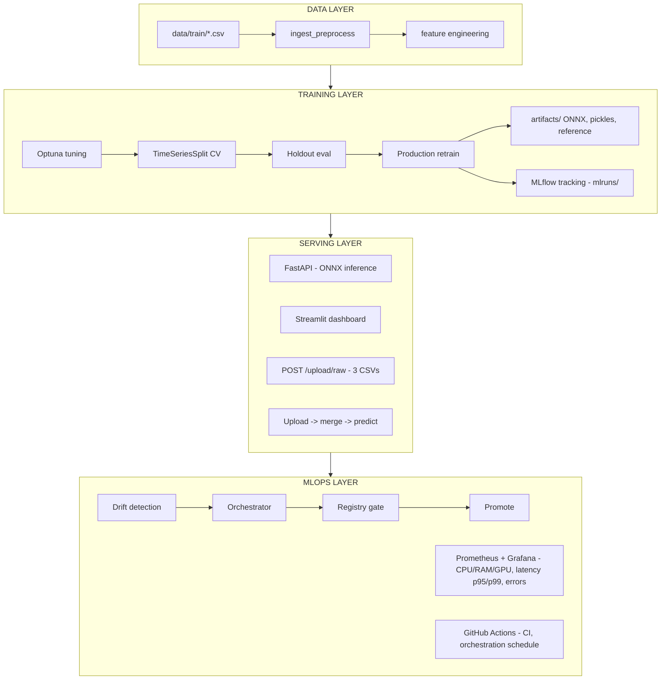

# RealEssate Forecast (End - to End project)

End-to-end **MLOps pipeline** for the Kaggle competition [**China Real Estate Demand Prediction**](https://www.kaggle.com/competitions/china-real-estate-demand-prediction). The system forecasts **monthly new-house transaction volumes** across **96 property sectors**, packages the model for production (**ONNX**), and exposes it through **FastAPI**, **Streamlit**,automate **drift monitoring** with **Mlfow**, **Grafana**, **CI/CD** and contain it by ** Docker**.


Demo of streamlit web: [Forecast]( https://realestateforecast-mdeeacuhemmtfwlog33stu.streamlit.app/ )
---

## Table of contents

1. [Context & problem](#1-context--problem)
2. [Project purpose](#2-project-purpose)
3. [Competition metric](#3-competition-metric)
4. [Model results](#4-model-results)
   - [4.1 CV](#41-cross-validation-train-portion) · [4.2 Holdout](#42-holdout-test-set-local-20-split) · [4.3 Kaggle](#43-kaggle-leaderboard-external-test) · [4.4 Feature importance](#44-feature-importance--model-insights)
5. [System architecture](#5-system-architecture)
6. [Project structure](#6-project-structure)
7. [Prerequisites](#7-prerequisites)
8. [Step-by-step guide](#8-step-by-step-guide)
9. [API reference](#9-api-reference)
10. [Configuration](#10-configuration)
11. [Tests & CI/CD](#11-tests--cicd)
12. [Run command using Makefile](#13-quick-start-with-makefile)


---

## 1. Context & problem

### Business context

China's residential market is highly **sectorized** — each city district / property cluster behaves differently. Developers and planners need reliable **month-ahead demand forecasts** to allocate inventory, pricing, and marketing spend.

The Kaggle competition provides historical monthly panels:

| Property | Value |
|----------|-------|
| **Granularity** | month × sector (96 sectors) |
| **Target** | `amount_new_house_transactions` |
| **Zero rate** | ~60%+ sector-months have zero transactions |
| **Exogenous signals** | nearby-sector activity, pre-owned market, sell-through, supply |

### Modelling challenges

- **Sparsity** — most sector-months are zero; naive averages fail badly.
- **Regime shifts** — COVID shock (2020), bull run (2021), policy tightening (2022–2024).
- **Leakage risk** — random CV inflates scores; we use **chronological TimeSeriesSplit**.
- **Custom metric** — Kaggle ranks by a two-stage **Competition Score**, not plain RMSE/R².

This repository turns the competition solution into a **production-ready MLOps stack**: reproducible training, artifact registry, serving, drift checks, and observability.

### Solution for this subject 


---

## 2. Project purpose

| Goal | Implementation |
|------|----------------|
| Accurate forecasting under competition metric | CatBoost + Optuna + zero-sector rules |
| Reproducible pipeline | `src/pipeline/` — ingest → features → train → evaluate |
| Production inference | ONNX model + `ModelRegistry` |
| Operational monitoring | Drift detection, Prometheus, Grafana |
| Human-in-the-loop | Streamlit upload / forecast / monitoring pages |
| Automation | GitHub Actions (test, build, weekly orchestration) |

**What this repo is:** a portfolio-grade ML system built on real competition data.

**What it is not:** a simple notebook export — training, serving, monitoring, and retrain gates are first-class components.

---

## 3. Competition metric

The official **Competition Score** (implemented in `src/pipeline/evaluation.py`):

1. **Stage 1 — bad-rate gate:** if more than 30% of predictions have APE > 100%, score = **0**.
2. **Stage 2 — refined MAPE:** on remaining "good" predictions:

$$\text{Score} = 1 - \frac{\text{MAPE}_{\text{good}}}{\text{good\_rate}}$$

Higher is better (max ≈ 1.0). This metric penalizes catastrophic errors more than R², which is why **Competition Score is the primary metric** for model selection and registry gates.

---

## 4. Model results

All scores below use the same **temporal 80/20 holdout** (last 20% months as test) and **5-fold TimeSeriesSplit CV** on the train portion, unless noted.

### 4.1 Cross-validation (using Timesriessplit _ Walk Forward validation)

| Model | CV Competition Score | CV MAE | CV R² | CV RMSE | CV MAPE|
|-------|---------------------:|-------:|------:|------:|--------:|
| **Seasonal Naive baseline** | 0.216 ± 0.176 | 24,999 | -0.128 | 52,024 | 193.64 |
| **Rule-based baseline** | 0.1455 ± 0.176 | 24,961 | -0.0992 | 51,546| 206.41 |
| **CatBoost baseline** (default hyperparams) | 0.198 ± 0.24 | 16,759 | 0.420 | 39,437 | 99.18 |
| **LightGBM baseline** | 0.000 ± 0.00 | 19,986 | 0.362 | 41,094 | 194.66 |
| **XGBoost baseline** | 0.000 ± 0.00 | 20,272 | 0.319 | 42,882 | 180.87 |
| **Random Forest baseline** | 0.000 ± 0.00 | 19,679 | 0.363 | 41,436 | 184.09 |
| **HistGB baseline** | 0.000 ± 0.00 | 19,680 | 0.383 | 41,436 | 184.09 |
| **CatBoost + Optuna** (50 trials) | **0.519 ± 0.062** | 15,602 | 0.394 | 39,421 | 0.394 |
| **LightGBM + Optuna** (50 trials) | 0.457 ± 0.073 | 16,463 | 0.371 | 49.342 | 76.85 |

Based on the cross-validation results, CatBoost + Optuna is selected as the final model. Although some baseline models achieve slightly higher R² values, CatBoost + Optuna provides the highest CV Competition Score (0.519 ± 0.062) and the lowest CV MAE (15,602) among all evaluated models. It also demonstrates better stability across walk-forward validation folds compared with other gradient boosting models. Since the competition metric is the primary evaluation criterion, the improved predictive accuracy and robustness of CatBoost + Optuna make it the most suitable final model for deployment.

### 4.2 Holdout test set (local 20% split)

Comparison on the **same temporal test set** after full pipeline training:

| Metric | CatBoost baseline | CatBoost tuned (production) |
|--------|------------------:|--------------------------:|
| **Competition Score** | 0.198 | **0.512** |
| MAE | 16,759 | **15,601** |
| RMSE | 39,437 | 39,421 |
| R² | 0.420 | 0.394 |
| MAPE | 99.18 | 67.10 |
| Bad rate (APE > 100%) | high | reduced |

Tuned model **holdout evaluation** (final pipeline run, notebook + `training.py`):

| Metric | Value |
|--------|------:|
| **Competition Score** | **0.564** |
| MAE | 10,352 |
| RMSE | 24,930 |
| R² | 0.473 |
| Bad rate | 12.4% |

> R² slightly drops after tuning while **Competition Score rises ~178%** — expected, because the competition metric prioritizes avoiding catastrophic errors over maximizing explained variance.

### 4.3 Kaggle leaderboard (external test)

Scores submitted to the competition platform:

| Split | Competition Score |
|-------|------------------:|
| **Public test** | **0.55** |
| **Private / hidden test** | **0.42** |

The performance gap between public (0.55) and hidden (0.42) test sets is consistent with distribution changes observed during drift analysis. The monitoring pipeline detected high **feature drift** (87.2% of features affected), particularly in temporal variables such as year, trend, regime, and time-series dynamics (lags and volatility features). This indicates that the hidden evaluation period likely represents a different market regime compared with the training/public period. Therefore, continuous drift monitoring and automated retraining mechanisms are necessary to maintain model performance over time.

### 4.4 Feature importance & model insights

Feature importance from the production **CatBoost** model (`notebooks/main_nb.ipynb`, top-30 by gain). Values are relative CatBoost importance scores — higher means the model relies on that signal more when splitting trees.

| Rank | Feature | Importance | Group |
|-----:|---------|----------:|-------|
| 1 | `zero_rate_6` | 15.97 | Sparsity / liquidity |
| 2 | `zero_rate_12` | 8.23 | Sparsity / liquidity |
| 3 | `rolling_max_12` | 7.83 | Rolling stats |
| 4 | `lag_1` | 7.25 | Short-term history |
| 5 | `sector_mean_train` | 5.89 | Sector profile |
| 6 | `rolling_mean_3` | 5.19 | Rolling stats |
| 7 | `trend_strength` | 4.94 | Volatility / regime |
| 8 | `sector_zero_rate_train` | 4.76 | Sector profile |
| 9 | `sellthrough_lag1` | 3.84 | Supply–demand |
| 10 | `rolling_std_3` | 3.80 | Rolling stats |
| 11 | `lag_2` | 3.35 | Short-term history |
| 12 | `nearby_supply_lag1` | 2.97 | Cross-sector spillover |
| 13 | `volatility_ratio` | 2.57 | Volatility / regime |
| 14–30 | lags, rolling means, `month`, `yoy_*`, … | 0.6–2.5 | Secondary |

**Feature groups in the pipeline** (`src/pipeline/features.py`):

- **Temporal:** `lag_1/2/3/6/12`, rolling mean/std/max/min, momentum, YoY
- **Sparsity:** `zero_rate_6`, `zero_rate_12` + zero-sector rule (85%+ zero → predict 0)
- **Sector profile:** `sector_mean_train`, `sector_zero_rate_train`, `sector_cv_train`, `sector_type`
- **Regime:** COVID / bull / tightening flags (`regime`, `regime_month_*`)
- **Cross-market (lag-1):** nearby supply, sell-through, price; pre-owned area

#### Key insights

**1. Market inactivity is the strongest signal**

`zero_rate_6` and `zero_rate_12` rank #1 and #2. The model learns whether a sector has entered a **low-liquidity / near-frozen** state — often more informative than price or calendar seasonality. This matches the 2019–2024 downturn when many districts saw long stretches with zero transactions.

**2. Recent history dominates**

`lag_1`, `lag_2`, `lag_3` and short rolling windows carry high importance. Real estate demand is **strongly autocorrelated**: weak months tend to persist, especially under policy stress or credit tightening.

**3. Rolling statistics beat simple linear trend**

`rolling_max_12`, `rolling_mean_3/6`, and rolling std matter more than a single long-term slope. In volatile regimes, **current level and recent volatility** are better predictors than extrapolating a straight trend.

**4. Sector heterogeneity is essential**

`sector_mean_train`, `sector_zero_rate_train`, and `sector_cv_train` are top-tier features. Each of the 96 sectors has distinct baseline volume, sparsity, and volatility — a global model without sector context would underperform.

**5. Sell-through reflects real demand**

`sellthrough_lag1` (inventory absorption speed) is among the top exogenous signals. High sell-through → tighter market; low sell-through → excess supply and weaker buyer confidence.

**6. Neighboring sectors spill over**

`nearby_supply_lag1` and `nearby_price_lag1` add meaningful signal. Local markets are **not independent** — buyers substitute across adjacent districts; developers compete on price and inventory.

**7. Seasonality is secondary in stressed markets**

Calendar features (`month`, `regime_month_cos`) rank low. During major shocks (COVID, developer debt crisis, policy tightening), **structural liquidity and confidence** outweigh normal seasonal patterns.

**8. YoY features add limited value under regime shift**

`yoy_diff` and `yoy_ratio` sit near the bottom. When the market shifts regime, **same-month-last-year** comparisons become unreliable; recent monthly dynamics are more useful.

#### Macroeconomic context (2019–2024)

The training window covers COVID shock (2020), a short bull run (2021), and prolonged policy tightening plus developer distress (2022–2024). In such a **stressed market**, the model correctly prioritizes liquidity signals (`zero_rate_*`, sell-through) over stable-era patterns (seasonality, YoY). That also explains why **public leaderboard (0.55)** outperforms **hidden test (0.42)**: the unreleased period likely continued shifting away from patterns seen in public validation months.

#### Design implications for this repo

| Insight | How the pipeline uses it |
|---------|--------------------------|
| Sparsity dominates | Zero-sector mask + `zero_rate_*` features |
| Short memory wins | Lag/rolling features with strict `shift(1)` to avoid leakage |
| Sector-specific behavior | Per-sector stats computed only on train fold |
| Cross-sector signal | Nearby & pre-owned CSVs merged at ingest |
| Public vs hidden gap (0.55 → 0.42) | Drift reference saved at train time; orchestrator can retrain |

> Reproduce the importance plot: run the feature-importance cell at the end of `notebooks/main_nb.ipynb` after training `final_model`.

---

## 5. System architecture



**Drift → retrain flow:**

```
New data → detect_data_drift() vs artifacts/reference.parquet
         → severity low?  STOP
         → else retrain → holdout eval → registry gate (score ≥ 0.50)
         → promote ONNX + refresh reference.parquet
```
Drift signals trigger investigation and retraining workflow, but retraining decisions are also validated against model performance degradation metrics.

---

## 6. Project structure

```
RealEssate_forecast/
├── configs/config.yaml           # Paths, CV, Optuna, orchestration gates
├── data/
│   ├── data_source.md
│   └── train/                    # 3 Kaggle CSVs (gitignored)
├── docker/                       # Compose: API, Streamlit, Prometheus, Grafana
├── notebooks/                    # EDA & experiment notebooks
├── src/
│   ├── api/                      # FastAPI + /metrics
│   ├── app/                      # Streamlit multipage dashboard
│   ├── models/                   # ONNX registry, retrain, artifacts
│   ├── monitoring/               # Drift, reference, Prometheus gauges
│   └── pipeline/                 # Ingest, features, training, orchestrator
├── artifacts/                    # model.onnx, pickles, reference.parquet
├── tests/
└── .github/workflows/            # pr-checks, build-and-push, orchestration
```

---

## 7. Prerequisites

| Tool | Version | Purpose |
|------|---------|---------|
| [uv](https://docs.astral.sh/uv/) | latest | Python env & deps (same as CI) |
| Python | **3.10+** | Runtime |
| Git | any | Clone repo |
| Kaggle account | — | Download competition CSVs |
| Docker (optional) | — | Full stack + monitoring |

---

## 8. Step-by-step guide

> Run all commands from the **project root**. Prefix with `uv run` if the virtualenv is not activated.

### Phase A — Environment setup (one time)

**A1. Install uv**

```bash
# macOS / Linux
curl -LsSf https://astral.sh/uv/install.sh | sh

# Windows (PowerShell)
powershell -ExecutionPolicy ByPass -c "irm https://astral.sh/uv/install.ps1 | iex"
```

**A2. Clone & create environment**

```bash
git clone https://github.com/lfcbsk/RealEssate_forecast.git
cd RealEssate_forecast

uv python install 3.11
uv venv --python 3.11
uv pip install -e ".[dev]"
```

**A3. Verify install**

```bash
uv run pytest tests/ -q -m "not e2e"
```

---

### Phase B — Data preparation (one time)

**B1. Download Kaggle data**

```bash
# Requires ~/.kaggle/kaggle.json
kaggle competitions download -c china-real-estate-demand-prediction -p data/train/
cd data/train && unzip china-real-estate-demand-prediction.zip && cd ../..
```

**B2. Confirm required files**

```
data/train/
├── new_house_transactions.csv
├── new_house_transactions_nearby_sectors.csv
└── pre_owned_house_transactions.csv
```

---

### Phase C — Train model (required before serving)

**C1. Full training pipeline**

```bash
uv run python -m src.pipeline.training
```

Pipeline steps executed automatically:

| Step | Action |
|------|--------|
| 0 | Ingest & merge 3 CSVs, impute, build month×sector grid |
| 1 | Identify zero-sectors (85%+ zero rate) |
| 2 | Optuna hyperparameter search (50 trials, CatBoost) |
| 3 | 5-fold TimeSeriesSplit CV with leakage-safe features |
| 4 | Retrain on train → **holdout evaluation** on test split |
| 5 | Retrain production model on full data |
| 6 | Save `artifacts/model.onnx` + pickles |
| 7 | Save drift reference `artifacts/reference.parquet` + stats |

**C2. Quick train (fewer Optuna trials, for testing)**

```python
from src.pipeline.training import run_pipeline
run_pipeline(tune=True, n_trials=5)
```

**C3. Baseline only (no tuning)**

```python
run_pipeline(tune=False)
```

**C4. Check outputs**

```
artifacts/
├── model.onnx
├── feature_list.pkl
├── sector_stats.pkl
├── sector_profile.pkl
├── zero_sectors.pkl
├── reference.parquet
└── reference_stats.json
mlruns/                  # MLflow experiment: catboost_timeseries
```

---

### Phase D — Serve & use the model

**D1. Start API**

```bash
uv run uvicorn src.api.main:app --host 0.0.0.0 --port 8000 --reload
```

Open Swagger UI: [http://localhost:8000/docs](http://localhost:8000/docs)

**D2. Start Streamlit dashboard**

```bash
uv run streamlit run src/app/streamlit_app.py
```

Open: [http://localhost:8501](http://localhost:8501)

| Page | What it does |
|------|--------------|
| **Home** | Overview, MLflow baseline metrics |
| **📤 Upload & Predict** | Upload 3 raw CSVs → merge into `data/train/` → predict |
| **📈 Sector Forecast** | Recursive 1–36 month forecast |
| **📊 Monitoring** | Drift, MLflow metrics, file health |

**D3. Upload new raw data (Streamlit or API)**

Data is **appended** to `data/train/*.csv`; duplicate `(month, sector)` rows are **overwritten**.

```bash
curl -X POST http://localhost:8000/api/v1/upload/raw \
  -F "main=@new_house_transactions.csv" \
  -F "nearby=@new_house_transactions_nearby_sectors.csv" \
  -F "pre=@pre_owned_house_transactions.csv"
```

**D4. Example forecast**

```bash
curl -X POST http://localhost:8000/api/v1/forecast \
  -H "Content-Type: application/json" \
  -d '{"n_months": 12}'
```

---

### Phase E — MLOps: drift check & retrain

**E1. Manual orchestration**

```bash
# Fast retrain (no Optuna) — routine check
uv run python -m src.pipeline.orchestrator --tune false --promote true

# Full retrain with Optuna
uv run python -m src.pipeline.orchestrator --tune true --promote true --n-trials 10
```

**E2. Registry promotion gates** (`configs/config.yaml`)

| Gate | Default | Meaning |
|------|---------|---------|
| `min_competition_score` | 0.50 | Minimum holdout score to promote model |
| `min_r2` | 0.0 | Minimum R² on holdout |
| `max_mape` | 150.0 | Maximum MAPE (%) |

Drift reports saved under `reports/`.

**E3. Scheduled run (GitHub Actions)**

Workflow `orchestration.yml` — weekly + manual `workflow_dispatch`.

---

### Phase F — Docker + monitoring (optional)

**F1. Start full stack**

```bash
cd docker
docker compose up --build
```

| Service | URL | Credentials |
|---------|-----|-------------|
| API | http://localhost:8000 | — |
| Streamlit | http://localhost:8501 | — |
| Grafana | http://localhost:3000 | `admin` / `admin` |
| Prometheus | http://localhost:9090 | — |

**F2. GPU monitoring (Linux + NVIDIA)**

```bash
docker compose --profile gpu up --build
```

Grafana dashboard **RealEstate MLOps Overview** includes: CPU/RAM, GPU util, API request rate, latency **p95/p99**, 4xx/5xx error rate, model/data/MLflow health.

---

### Quick checklist (first time)

```
[ ] A2  uv venv + pip install -e ".[dev]"
[ ] B1  Download 3 CSVs → data/train/
[ ] C1  uv run python -m src.pipeline.training
[ ] D1  uv run uvicorn src.api.main:app --reload
[ ] D2  uv run streamlit run src/app/streamlit_app.py
[ ] A3  uv run pytest tests/ -v
```

---

## 9. API reference

| Endpoint | Method | Description |
|----------|--------|-------------|
| `/api/v1/health` | GET | Health check |
| `/api/v1/forecast` | POST | Multi-month recursive forecast |
| `/api/v1/predict` | POST | Single-row prediction (feature dict) |
| `/api/v1/upload/raw` | POST | Upload 3 raw CSVs → merge → predict |
| `/api/v1/upload` | POST | Batch predict (pre-engineered features, 1 file) |
| `/api/v1/sectors` | GET | Sector list & zero-sector info |
| `/api/v1/metrics` | GET | MLflow run metrics |
| `/api/v1/drift` | GET | Drift detection report |
| `/metrics` | GET | Prometheus exposition format |
| `/docs` | GET | Swagger UI |

---

## 10. Configuration

`configs/config.yaml`:

```yaml
data:
  train_dir: "./data/train/"

target:
  column: amount_new_house_transactions
  transform: log1p

cv:
  n_splits: 5

optimization:
  n_trials: 50          # reduce to 5 for quick experiments

orchestration:
  drift:
    feature_drift_ratio_threshold: 0.2
    severity_for_retrain: ["medium", "high"]
  registry:
    min_competition_score: 0.5    # tune to 0.55 to match Kaggle public baseline
    min_r2: 0.0
    max_mape: 150.0
```

---

## 11. Tests & CI/CD

```bash
uv run pytest tests/ -v -m "not e2e"
uv run pytest tests/ --cov=src --cov-fail-under=50
```

| Workflow | Trigger | Purpose |
|----------|---------|---------|
| `pr-checks.yml` | PR / push | pytest, lint, Docker build |
| `build-and-push.yml` | push `main`, tags | GHCR image publish |
| `orchestration.yml` | weekly + manual | Drift check & optional retrain |

---
---

## 13. Quick start with Makefile

A `Makefile` is provided to wrap the most common commands above. Run all `make` commands from the **project root**.

| Command | Equivalent to | Description |
|---|---|---|
| `make help` | — | List all available targets |
| `make install` | A2 | Create `uv` venv (Python 3.10) + install deps (`.[dev]`) |
| `make train` | C1 | Run the full training pipeline |
| `make api` | D1 | Start FastAPI at http://localhost:8000 |
| `make streamlit` | D2 | Start Streamlit dashboard at http://localhost:8501 |
| `make orchestrate-fast` | E1 (fast) | Drift check + retrain (no Optuna), auto-promote if gate passed |
| `make orchestrate-full` | E1 (full) | Drift check + retrain with Optuna (10 trials) |
| `make test` | A3 / 11 | Run `pytest tests/ -v -m "not e2e"` |
| `make test-cov` | 11 | Run pytest with coverage (`--cov=src --cov-fail-under=50`) |
| `make lint` | — | Run `flake8` on `src/` and `tests/` |
| `make docker-up` | F1 | `docker compose up --build` in `docker/` |
| `make docker-up-gpu` | F2 | `docker compose --profile gpu up --build` |
| `make docker-down` | — | Stop and remove containers |
| `make clean` | — | Remove `__pycache__`, `.pytest_cache`, `.ruff_cache`, coverage files |

### Typical first-run workflow

```bash
make install                # Phase A: setup environment & deps

# Phase B (manual): download 3 Kaggle CSVs into data/train/
#   kaggle competitions download -c china-real-estate-demand-prediction -p data/train/
#   cd data/train && unzip *.zip && cd ../..

make train                  # Phase C: train model, generate artifacts/

make api                     # Phase D1: start API   (run in its own terminal)
make streamlit                # Phase D2: start dashboard (run in another terminal)

make test                    # Phase A3 / Section 11: sanity check
```

### MLOps / retrain workflow

```bash
make orchestrate-fast        # routine drift check, quick retrain if needed
make orchestrate-full         # full retrain with Optuna tuning
```

### Docker stack (optional)

```bash
make docker-up                # API + Streamlit + Prometheus + Grafana
make docker-up-gpu             # same, with GPU monitoring profile
make docker-down               # tear everything down
```

> All `make` targets use `uv run ...` under the hood, so you don't need to manually activate the virtual environment.

